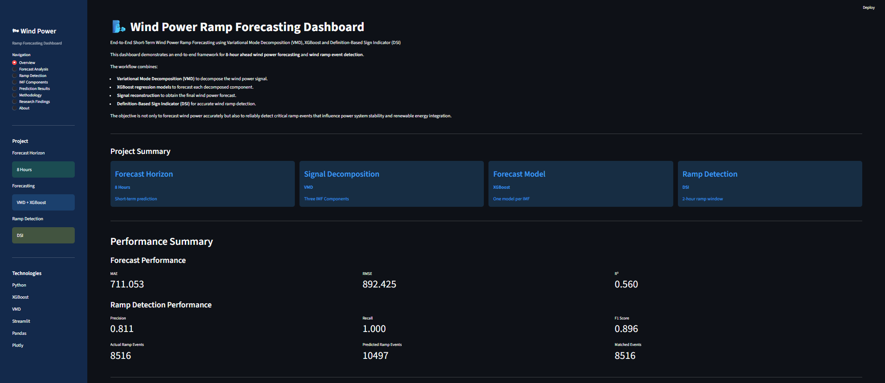
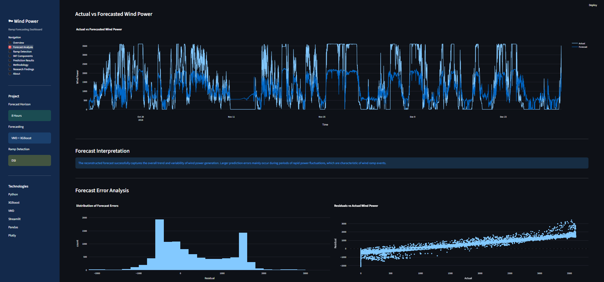
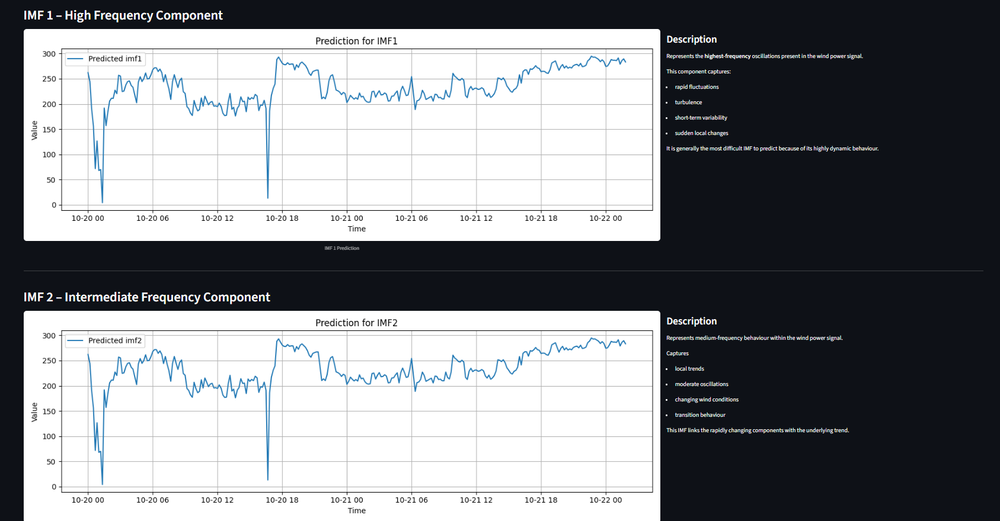
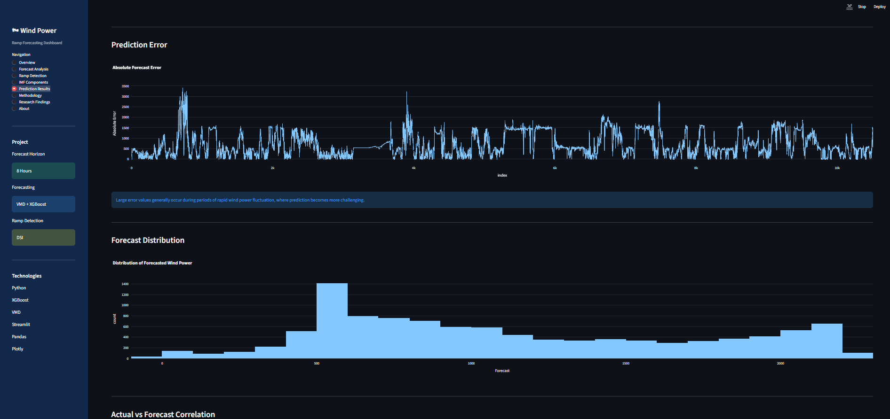
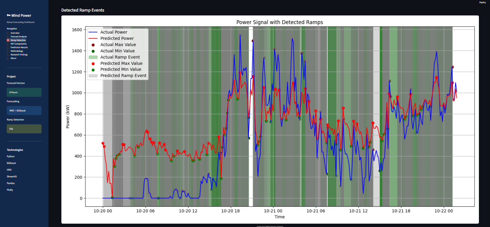
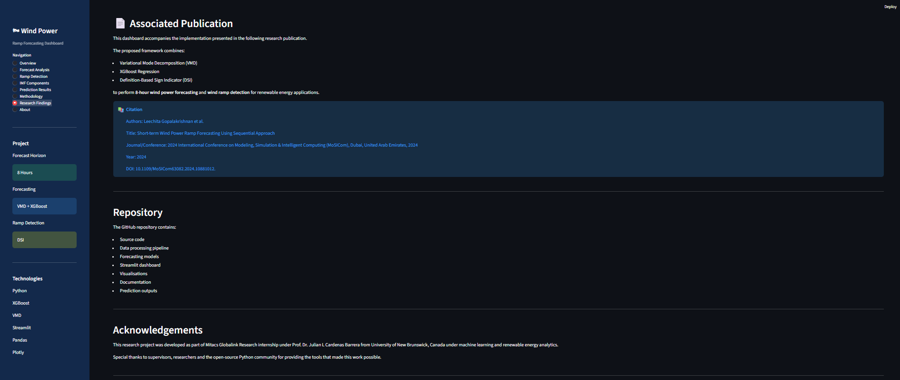

# 🌬️ Wind Power Ramp Forecasting Using VMD–XGBoost


An end-to-end machine learning framework for **8-hour wind power forecasting** and **wind ramp detection** using **Variational Mode Decomposition (VMD)**, **Extreme Gradient Boosting (XGBoost)**, and an interactive **Streamlit dashboard**.

The project focuses on detecting significant wind power ramp events while maintaining reliable short-term forecasting performance. It implements the methodology presented in the associated research publication and provides an interactive dashboard for analysing forecasting results, decomposition components, and ramp detection metrics.

---

## 📌 Project Overview

Wind power generation is highly variable due to changing weather conditions. Sudden increases or decreases in power output, known as **wind ramp events**, can significantly affect power system stability and grid operations.

This project proposes a hybrid forecasting framework that:

- Decomposes the wind power signal using Variational Mode Decomposition (VMD)
- Predicts each Intrinsic Mode Function (IMF) using XGBoost regression
- Reconstructs the final wind power forecast
- Detects wind ramp events using a Definition-Based Sign Indicator (DSI)
- Visualises results through an interactive Streamlit dashboard

---
## 🚀 Project Highlights & Features

This project delivers a complete end-to-end framework for **short-term (8-hour) wind power forecasting** and **wind ramp detection** using a hybrid machine learning approach. The key features include:

- End-to-end wind power forecasting pipeline
- 8-hour ahead wind power prediction
- Published research implementation
- Variational Mode Decomposition (VMD) for signal decomposition
- IMF-wise forecasting using XGBoost regression models
- Signal reconstruction through IMF integration
- Wind ramp detection using the Definition-Based Sign Indicator (DSI) approach
- Forecast performance evaluation (MAE, RMSE, R², MAPE, sMAPE)
- Ramp detection performance evaluation (Precision, Recall, F1-Score)
- Interactive Streamlit dashboard for result exploration
- Forecast visualisation and ramp event analysis
- Downloadable prediction results and evaluation reports
- Research-oriented visualisations and performance insights
- Modular, reproducible, and scalable project architecture

---

## 🏗️ Project Structure

```text
wind-power-ramp-forecasting/
│
├── app/
│   └── streamlit_app2.py
│
├── data/
│   ├── raw/
│   └── processed/
│
├── notebooks/
│
├── outputs/
│   ├── metrics/
│   ├── plots/
│   └── predictions/
│
├── src/
│   ├── preprocess.py
│   ├── decompose.py
│   ├── train.py
│   ├── integrate.py
│   ├── ramp_detection.py
│   ├── utils.py
│   └── config.py
│
├── models/
├── screenshots/
├── main.py
├── requirements.txt
├── LICENSE
├── CITATION.cff
└── README.md
```

---

## ⚙️ Methodology

The proposed framework consists of the following stages:

1. Data preprocessing
2. Variational Mode Decomposition (VMD)
3. IMF-wise XGBoost forecasting
4. Signal reconstruction
5. Forecast evaluation
6. Wind ramp detection using DSI
7. Interactive dashboard visualisation

## Workflow

The complete forecasting framework follows the pipeline below.

See **assets/workflow.md** for the detailed workflow.

---

## 📊 Performance

### Forecast Performance

| Metric | Value |
|---------|-------:|
| MAE | 704.601 |
| RMSE | 881.274 |
| R² | 0.571 |

### Ramp Detection Performance

| Metric | Value |
|---------|-------:|
| Precision | 0.811 |
| Recall | 1.000 |
| F1 Score | 0.896 |

The framework prioritises accurate wind ramp detection while maintaining balanced forecasting performance.

---

## 🖥️ Streamlit Dashboard

The dashboard provides:

- Forecast performance summary
- Ramp detection summary
- Actual vs forecast comparison
- Prediction results
- IMF component analysis
- Methodology overview
- Downloadable forecast outputs

Run the dashboard using:

```bash
streamlit run app/streamlit_app2.py
```

---
## Dashboard Preview

### Dashboard Overview



---

### Forecast Analysis



---
### IMF Components


---
### Prediction Results


---
### Ramp Detection


---
### Methodology


---
### Research Findings


---

## ▶️ Installation

Clone the repository:

```bash
git clone https://github.com/<your-username>/wind-power-ramp-forecasting.git
```

Move into the project directory:

```bash
cd wind-power-ramp-forecasting
```

Create a virtual environment:

```bash
python -m venv .venv
```

Activate it:

Windows

```bash
.venv\Scripts\activate
```

Install dependencies:

```bash
pip install -r requirements.txt
```

---

## ▶️ Running the Project

Execute the forecasting pipeline:

```bash
python main.py
```

Launch the dashboard:

```bash
streamlit run app/streamlit_app2.py
```

---

## 🛠️ Technologies Used

- Python
- Pandas
- NumPy
- Scikit-learn
- XGBoost
- VMDPy
- Streamlit
- Plotly
- Matplotlib
- Joblib

---

## 📄 Research Publication

This implementation accompanies the following publication:

**Leechita Gopalakrishnan et al.**

*Short-term Wind Power Ramp Forecasting Using Sequential Approach*

**2024 International Conference on Modeling, Simulation & Intelligent Computing (MoSICom)**

Dubai, United Arab Emirates

DOI:
https://doi.org/10.1109/MoSICom63082.2024.10881012

---

## 📚 Citation

If you use this repository in your research, please cite:

> Gopalakrishnan, L., et al. *Short-term Wind Power Ramp Forecasting Using Sequential Approach*. Proceedings of the 2024 International Conference on Modeling, Simulation & Intelligent Computing (MoSICom), Dubai, United Arab Emirates, 2024. https://doi.org/10.1109/MoSICom63082.2024.10881012

A machine-readable citation is available in the `CITATION.cff` file.

---

## 🤝 Contributing

Contributions are welcome.

Please read `CONTRIBUTING.md` before submitting pull requests.

---
## Future Work

Future improvements include:

- Transformer-based forecasting
- LSTM comparison
- CEEMDAN decomposition
- Real-time forecasting
- Multi-site forecasting
- Cloud deployment
- Explainable AI for forecasting
---
## Acknowledgements

This work is based on the published research presented at the 2024 International Conference on Modeling, Simulation & Intelligent Computing (MoSICom).

The author gratefully acknowledges the support received during the research and development of this project.
---

## 📜 License

This project is licensed under the MIT License.

See the `LICENSE` file for details.

---

## 👩‍💻 Author

**Leechita Gopalakrishnan**

Master of Data Science and Innovation

University of Technology Sydney

---

⭐ If you find this project useful, consider giving the repository a star.